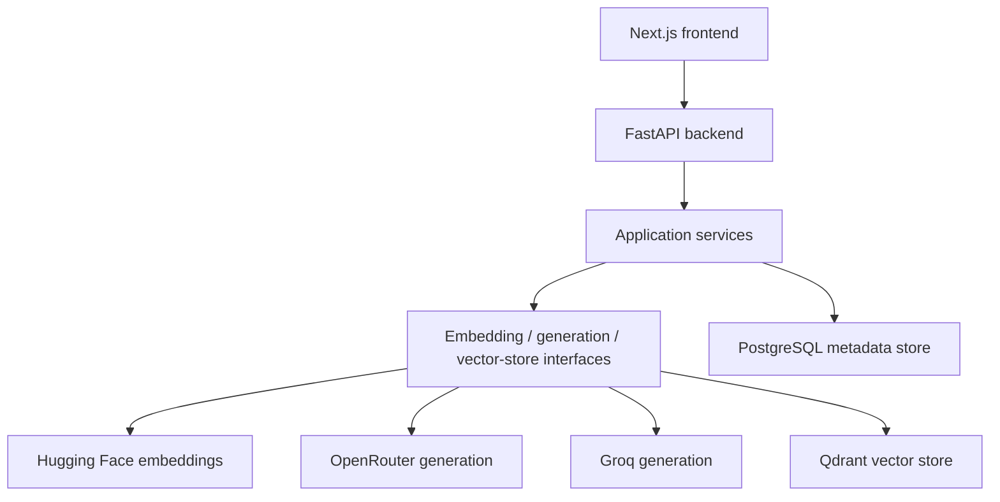

# Architecture Overview

ShowcaseHost is a modular monolith with a Next.js frontend and FastAPI backend. External AI and storage providers sit behind internal interfaces so they can change without forcing domain rewrites.

The backend should remain a single deployable service until a specific scaling or ownership need justifies splitting it.

Repository ingestion uses a GitHub App, durable PostgreSQL jobs, and provider-neutral source-control
and snapshot-storage boundaries. See [Repository Ingestion](repository-ingestion.md).

The next durable stage uses a warm local Node companion for `code-chunk` while Python retains
workflow and storage ownership. See [AST-Aware Chunking](ast-aware-chunking.md).

Successful chunking queues a durable embedding job. The API exposes processed/total chunk progress
through the parent ingestion status, while the worker handles Hugging Face batching, concurrency,
rate-limit/cold-start retries, model fallback, and incremental Qdrant upserts internally.

Repository chat reuses the embedding model recorded for the latest successful snapshot, performs
repository- and snapshot-filtered vector search, and streams cited answers through the
provider-neutral generation boundary. See [Repository Chat](repository-chat.md).
